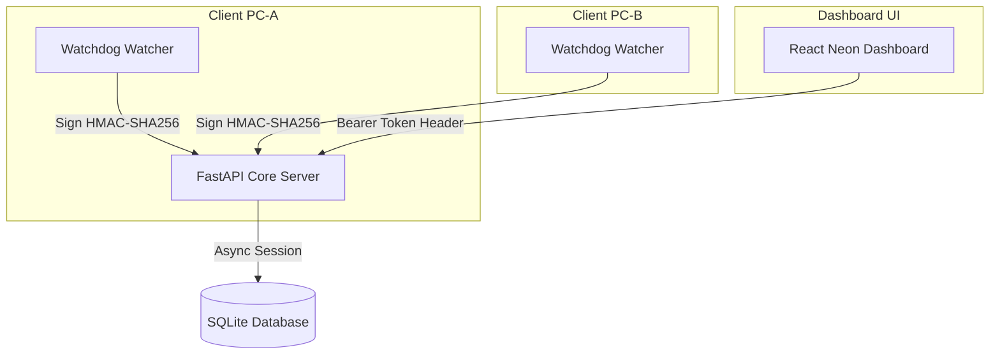

# SetSync Platform — Decentralized File Set Synchronization

SetSync is a production-grade, local-first synchronization and conflict-resolution engine designed to monitor and harmonize file systems between two distinct PCs (**PC-A** and **PC-B**).

The architecture consists of:
1. **Core Service (FastAPI):** Central coordination engine managing inventory catalogs, performing index-optimized database set operations, and executing action requests (copies/moves).
2. **Neon Web Dashboard (React + Vite + TypeScript):** A sleek, dark-neon control center showing real-time file unions, intersections, only-on-PC-X splits, conflict directories, audit logs, and dry-run action validations.
3. **Inventory Agent CLI (Python + Watchdog):** Background daemon running on client PCs that recursively indexes files, caches stats to skip redundant hashing, registers real-time directory changes, and pushes secure cryptographically signed delta payloads.

---

## Technical Features

*   **Optimized SQL Set Engine:** Set comparisons (unions, intersections, only-A/B, conflicts) are calculated directly inside the SQLite database using index-optimized joins, yielding sub-millisecond lookups.
*   **Atomic Transactions:** Ingests are wrapped in rollback transactions to protect the database catalog from network/client crashes during uploads.
*   **HMAC-SHA256 Signatures:** Webhook and client agent calls are validated using timed HMAC signatures (`X-SetSync-Signature` and `X-SetSync-Timestamp`) protecting endpoints from replay attacks.
*   **Debounced Delta Watcher:** The watchdog agent coalesces directory changes and sends small delta JSON packages to `PATCH /inventory/delta` instead of walking the full disk repeatedly.
*   **Secure Lock Screen:** Dynamic API tokens are stored in the client's `localStorage` rather than hardcoding credentials inside static javascript bundles.

---

## Architecture Layout



---

## Setup & Quickstart

### Prerequisites
- Python 3.10+
- Node.js 18+

### 1. Set Up Virtual Environment & Dependencies
In the root directory, create the virtual environment and install dependencies:
```bash
# Create venv
python -m venv .venv

# Activate venv (Windows)
.venv\Scripts\activate

# Install Backend dependencies
pip install -r backend/requirements.txt

# Install Agent dependencies
pip install -r agent/requirements.txt
```

### 2. Seed Test Environments (Simulation Mode)
To simulate two PC folders with overlaps, conflicts, and unique files:
```bash
python seed_test_dirs.py
```
This creates folders `./test_pc_a/` and `./test_pc_b/` preloaded with test files.

### 3. Start Core API Server
Run the FastAPI backend on port 8000:
```bash
cd backend
..\.venv\Scripts\python -m uvicorn app.main:app --port 8000 --reload
```
*The database file `setsync.db` will automatically initialize.*

### 4. Seed and Watch Client Agents
Open a new terminal and run initial inventories:
```bash
# Sync PC-A
.venv\Scripts\python -m agent.cli scan --root ./test_pc_a --pc A

# Sync PC-B
.venv\Scripts\python -m agent.cli scan --root ./test_pc_b --pc B
```

To enable real-time tracking (which monitors edits, deletions, and additions):
```bash
# Watch PC-A
.venv\Scripts\python -m agent.cli watch --root ./test_pc_a --pc A
```

### 5. Launch the Dashboard
Navigate to the frontend folder, install dependencies, and boot the development server:
```bash
cd frontend
npm install
npm run dev
```
Open `http://localhost:5173/` in your browser. You will be greeted with the secure decrypt screen. Type the API token:
`setsync_secret_token_123`

---

## Agent CLI Command Guide

*   **Full Sync:**
    ```bash
    python -m agent.cli scan --root <directory_path> --pc <A|B>
    ```
*   **Real-time watch daemon:**
    ```bash
    python -m agent.cli watch --root <directory_path> --pc <A|B>
    ```

---

## Key Limitations

1. **Two-PC Limit:** Hardcoded to comparison between 2 machines.
2. **Scanner Caps:** Skips single files larger than 10GB and caps overall cataloging at 10,000 files.
3. **Whole-File Transfers:** Copies complete files; does not support block-level delta compression.
4. **NAT Traversal:** Requires VPN (like Tailscale) if nodes are behind external firewalls.
